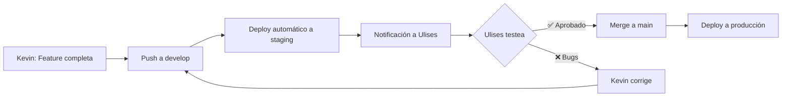

# 🚀 Plan de Implementación: Objetivo Vientre Plano PRO
## Análisis de Viabilidad y Estrategia de Desarrollo

**Fecha:** 2025-11-23
**Developer:** Kevin
**Proyecto:** Evolución de Lead Magnet a Plataforma Premium

---

## 📊 ANÁLISIS DE VIABILIDAD

### ✅ **VIABILIDAD: ALTA (95%)**

#### **Fortalezas del Proyecto Actual**

1. **Arquitectura Sólida**
   - ✅ Monorepo con pnpm workspaces (separación clara frontend/backend)
   - ✅ TypeScript end-to-end con type safety
   - ✅ Prisma ORM ya configurado con PostgreSQL
   - ✅ Base de datos con modelos `User` y `ConversationalMemory` YA definidos
   - ✅ Sistema de sesiones funcional

2. **Stack Moderno y Escalable**
   - ✅ React 18 + Vite (performance óptimo)
   - ✅ Zustand con persist middleware (preparado para auth state)
   - ✅ TanStack Query para data fetching
   - ✅ Express + TypeScript backend modular

3. **Features Ya Implementadas**
   - ✅ Sistema de límites de interacción (FREE vs PRO)
   - ✅ OpenAI Responses API integrada
   - ✅ Análisis de imágenes con Vision
   - ✅ Rate limiting configurado
   - ✅ Middleware de autenticación básico (listo para extender)
   - ✅ Modelo `ConversationalMemory` en schema (¡LISTO para usar!)

4. **Código Limpio y Mantenible**
   - ✅ Separación de concerns (controllers, services, middleware)
   - ✅ Logger centralizado
   - ✅ Error handling estructurado
   - ✅ Validación con Zod

#### **Gaps a Resolver**

1. **Sistema de Autenticación** 🟡 (Moderado - 2-3 días)
   - Modelos User existentes pero sin JWT implementation
   - Necesita: bcrypt, jsonwebtoken, email verification
   - Middleware auth básico (requiere extensión)

2. **Migración a Anthropic Agents SDK** 🔴 (Complejo - 3-4 días)
   - Actualmente usa OpenAI Responses API
   - **CRÍTICO:** Verificar compatibilidad con Anthropic SDK
   - Requiere refactor de `conversational-assistant.service.ts`

3. **Dashboard de Usuario** 🟢 (Simple - 3-4 días)
   - Componentes React reutilizables ya existen
   - Solo requiere nuevas vistas y routing

4. **Sistema de Memoria Persistente** 🟢 (Simple - 1-2 días)
   - ¡Modelo `ConversationalMemory` YA existe en Prisma!
   - Solo necesita lógica de sync con Anthropic

---

## ⚠️ CONSIDERACIONES CRÍTICAS

### 🔴 **1. Anthropic Agents SDK vs OpenAI Responses API**

**PROBLEMA:** La propuesta menciona migrar a Anthropic Agents SDK, pero:

- El proyecto actual usa OpenAI GPT-4o con Responses API
- Anthropic Agents SDK tiene un modelo de conversación diferente
- Requiere reescritura completa del servicio de chat

**OPCIONES:**

#### **Opción A: Migración Completa a Anthropic (Recomendada para PRO)**
- **Pros:**
  - Memoria conversacional nativa de Claude
  - Mejor contexto a largo plazo
  - Mejor razonamiento para diagnósticos complejos
  - Costo potencialmente menor (dependiendo del volumen)
- **Contras:**
  - 3-4 días de refactoring
  - Requiere re-testing completo
  - Curva de aprendizaje del SDK
- **Tiempo:** +4 días al timeline

#### **Opción B: Dual Mode (Híbrido)**
- **Pros:**
  - Lead Magnet mantiene OpenAI (sin cambios)
  - Solo usuarios PRO usan Anthropic
  - Menor riesgo
  - Testing gradual
- **Contras:**
  - Doble mantenimiento de código
  - Mayor complejidad
- **Tiempo:** +5 días al timeline

#### **Opción C: Mantener OpenAI + Memoria Custom (Más Rápido)**
- **Pros:**
  - Sin refactoring mayor
  - Usa tabla `ConversationalMemory` existente
  - Timeline original se mantiene
  - Menor riesgo técnico
- **Contras:**
  - Memoria no es nativa de la IA
  - Requiere más lógica custom
  - Menos "inteligente" que Anthropic nativo
- **Tiempo:** Sin días adicionales

**MI RECOMENDACIÓN:** Opción A para maximizar valor PRO, pero requiere buy-in de timeline extendido.

---

### 🟡 **2. Features de "App Anterior" - Pendiente de Definir**

La propuesta menciona migrar features de una app anterior, pero no están especificadas.

**BLOCKER:** Necesitamos reunión con Ulises para definir:
- ¿Cuál es la "app anterior"?
- ¿Qué features específicas migrar?
- ¿Priorización de features?

**PROPUESTA:** Lanzar MVP sin features de app anterior primero, luego iterar.

---

## 🎯 PLAN DE IMPLEMENTACIÓN

### **ESTRATEGIA: Desarrollo Iterativo en 3 Fases**

#### **Fase 0: Setup de Ambiente de Pruebas (2 días)**
*Antes de tocar producción*

**Objetivos:**
- Branch `develop` con ambiente aislado
- Base de datos de staging
- Deploy automático a ambiente de prueba
- Ulises puede testear en paralelo al desarrollo

**Entregables:**
- ✅ Branch `develop` protegido
- ✅ DB staging con datos de prueba
- ✅ URL de staging (ej: `https://staging.objetivovientreplano.com`)
- ✅ CI/CD pipeline (GitHub Actions)
- ✅ Variables de entorno para staging

---

#### **Fase 1: Fundación (MVP Core) - 7-8 días**
*Sistema de auth + Memoria básica + Dashboard mínimo*

##### **Sprint 1.1: Autenticación (3 días)**

**Backend:**
- [ ] Extender modelo `User` en Prisma con campos auth
  ```prisma
  model User {
    password      String
    isVerified    Boolean @default(false)
    verifyToken   String?
    resetToken    String?
    role          String  @default("FREE") // "FREE" | "PRO"
  }
  ```
- [ ] Servicios:
  - `auth.service.ts` (register, login, verify, reset)
  - JWT generation/validation
  - bcrypt para passwords
- [ ] Controllers: `auth.controller.ts`
- [ ] Routes: `/api/auth/*`
- [ ] Middleware: Extender `auth.middleware.ts` con JWT

**Frontend:**
- [ ] Componentes:
  - `LoginForm.tsx`
  - `RegisterForm.tsx`
  - `ForgotPasswordForm.tsx`
- [ ] Store: `useAuthStore.ts` (Zustand + persist)
- [ ] Protected routes con React Router
- [ ] Interceptor axios para JWT

**Testing:**
- [ ] Registro de usuario
- [ ] Login/logout
- [ ] Protección de rutas
- [ ] Expiración de token

##### **Sprint 1.2: Memoria Persistente (2 días)**

**Backend:**
- [ ] Servicio `memory.service.ts`
  - Guardar conversación en `ConversationalMemory`
  - Cargar memoria al iniciar sesión
  - Sync automático cada N mensajes
- [ ] Hooks en `chat.controller.ts` para guardar memoria
- [ ] Endpoint `GET /api/memory/:userId` (historial)

**Frontend:**
- [ ] Hook `useConversationMemory.ts`
- [ ] UI para mostrar "Clara recuerda..." (opcional)

**Testing:**
- [ ] Crear sesión → guardar memoria → cerrar
- [ ] Reabrir sesión → memoria cargada
- [ ] Múltiples sesiones del mismo usuario

##### **Sprint 1.3: Dashboard Básico (2-3 días)**

**Frontend:**
- [ ] Layout:
  - `/dashboard` route
  - Sidebar con navegación
  - Header con user menu
- [ ] Vistas:
  - `/dashboard/home` (vista general)
  - `/dashboard/sessions` (historial de conversaciones)
  - `/dashboard/profile` (datos del usuario)
- [ ] Componentes:
  - `SessionCard.tsx` (lista de sesiones)
  - `UserProfile.tsx`
  - `StatsWidget.tsx` (métricas básicas)

**Backend:**
- [ ] Endpoint `GET /api/users/:id/sessions` (todas las sesiones)
- [ ] Endpoint `GET /api/users/:id/stats` (métricas)

**Testing:**
- [ ] Navegación del dashboard
- [ ] Visualización de historial
- [ ] Perfil de usuario editable

---

#### **Fase 2: Features Premium (5-7 días)**
*Diferenciadores FREE vs PRO*

##### **Sprint 2.1: Sistema de Roles y Límites (2 días)**

**Backend:**
- [ ] Middleware `checkSubscription.ts`
  - Verificar role del usuario
  - Aplicar límites según role
- [ ] Extender `limits.ts` con lógica FREE/PRO
  ```typescript
  export const LIMITS = {
    FREE: {
      messages: 20,
      photos: 1,
      sessions_per_month: 1,
    },
    PRO: {
      messages: Infinity,
      photos: Infinity,
      sessions_per_month: Infinity,
    }
  }
  ```
- [ ] Lógica en `chat.controller.ts` para enforcement

**Frontend:**
- [ ] Banner "Upgrade to PRO" cuando se alcancen límites
- [ ] Modal de comparación FREE vs PRO
- [ ] Badge "PRO" en UI

##### **Sprint 2.2: Perfil de Salud Dinámico (3 días)**

**Backend:**
- [ ] Extender `ConversationalMemory` con:
  ```typescript
  foodsGood: string[]      // Alimentos que le caen bien
  foodsBad: string[]       // Alimentos trigger
  symptoms: Json           // { hinchazón: [dates], dolor: [dates] }
  medications: string[]
  goals: Json[]
  ```
- [ ] Servicio `health-profile.service.ts`
  - Extraer info de conversaciones (OpenAI function calling)
  - Actualizar perfil automáticamente
- [ ] Endpoints:
  - `GET /api/users/:id/health-profile`
  - `PUT /api/users/:id/health-profile`

**Frontend:**
- [ ] Vista `/dashboard/health`
- [ ] Componentes:
  - `FoodsList.tsx` (buenos/malos)
  - `SymptomsChart.tsx` (gráfica temporal)
  - `GoalsTracker.tsx`
  - `MedicationsList.tsx`
- [ ] Edición manual del perfil

##### **Sprint 2.3: Seguimiento de Progreso (2 días)**

**Backend:**
- [ ] Tabla nueva:
  ```prisma
  model ProgressEntry {
    id        String   @id @default(cuid())
    userId    String
    date      DateTime
    symptom   String
    severity  Int      // 1-10
    notes     String?
  }
  ```
- [ ] Endpoints CRUD para progress entries

**Frontend:**
- [ ] Vista `/dashboard/progress`
- [ ] Gráficas con Recharts o Chart.js
- [ ] Log diario de síntomas (quick entry)

---

#### **Fase 3: Polish y Launch (3 días)**

##### **Sprint 3.1: UX Premium (1 día)**
- [ ] Animaciones con Framer Motion
- [ ] Loading states mejorados
- [ ] Empty states
- [ ] Onboarding para usuarios nuevos

##### **Sprint 3.2: Testing End-to-End (1 día)**
- [ ] Playwright/Cypress tests críticos
- [ ] Testing de flujos completos
- [ ] Performance testing
- [ ] Mobile responsiveness

##### **Sprint 3.3: Deploy y Handoff (1 día)**
- [ ] Deploy a producción
- [ ] Documentación técnica
- [ ] Sesión de capacitación con Ulises
- [ ] Handover checklist

---

## 🏗️ ESTRATEGIA DE AMBIENTE DE PRUEBAS

### **Arquitectura de Ambientes**

```
┌─────────────────┐
│   PRODUCCIÓN    │ ← Lead Magnet Actual (NO TOCAR)
│  main branch    │
└─────────────────┘

┌─────────────────┐
│    STAGING      │ ← Ulises testea aquí
│  develop branch │ ← Deploy automático
└─────────────────┘

┌─────────────────┐
│     LOCAL       │ ← Kevin desarrolla
│  feature/*      │
└─────────────────┘
```

### **Setup de Staging**

#### **Opción 1: Vercel Preview Deployments (Recomendado)**
**Pros:**
- Gratis para hobby projects
- Deploy automático en cada push
- URL única por branch
- Preview environments

**Setup:**
1. Conectar repo a Vercel
2. Configurar `develop` branch como production branch en Vercel
3. Variables de entorno de staging
4. PostgreSQL staging en Neon/Supabase (free tier)

**Costo:** $0 (dentro de free tier)

#### **Opción 2: Railway/Render**
**Pros:**
- Full stack deployment (frontend + backend + DB)
- Free tier disponible
- Fácil setup

**Costo:** $0-5/mes

#### **Opción 3: VPS propio (Digital Ocean/Hetzner)**
**Pros:**
- Control total
- Mismo ambiente que producción

**Contras:**
- Más setup manual
- Requiere DevOps

**Costo:** $5-10/mes

**MI RECOMENDACIÓN:** Opción 1 (Vercel) para frontend + Neon para DB staging.

---

### **Workflow de Testing para Ulises**



**URL de Staging:** `https://staging-objetivovientreplano.vercel.app`

**Credenciales de prueba:**
```
FREE user:
- Email: test-free@ovp.com
- Password: TestFree123!

PRO user:
- Email: test-pro@ovp.com
- Password: TestPro123!
```

---

## 📅 TIMELINE COMPLETO

### **Escenario Conservador (con Anthropic migration)**

| Fase | Duración | Inicio | Fin |
|------|----------|--------|-----|
| **Fase 0: Setup Staging** | 2 días | Día 1 | Día 2 |
| **Fase 1: MVP Core** | 8 días | Día 3 | Día 10 |
| **Fase 2: Features Premium** | 7 días | Día 11 | Día 17 |
| **Fase 3: Polish** | 3 días | Día 18 | Día 20 |
| **TOTAL** | **20 días laborables** | - | **~4 semanas** |

### **Escenario Optimista (sin Anthropic, OpenAI custom memory)**

| Fase | Duración | Inicio | Fin |
|------|----------|--------|-----|
| **Fase 0: Setup Staging** | 2 días | Día 1 | Día 2 |
| **Fase 1: MVP Core** | 7 días | Día 3 | Día 9 |
| **Fase 2: Features Premium** | 5 días | Día 10 | Día 14 |
| **Fase 3: Polish** | 3 días | Día 15 | Día 17 |
| **TOTAL** | **17 días laborables** | - | **~3.5 semanas** |

---

## 🎁 ENTREGABLES POR FASE

### **Fase 0**
- ✅ Repositorio con branch `develop`
- ✅ CI/CD configurado
- ✅ URL de staging funcional
- ✅ Base de datos de staging con seed data
- ✅ Documentación de testing para Ulises

### **Fase 1 (MVP)**
- ✅ Sistema de login/registro funcional
- ✅ JWT authentication
- ✅ Protección de rutas
- ✅ Memoria persistente entre sesiones
- ✅ Dashboard básico con 3 vistas
- ✅ Historial de conversaciones
- ✅ Tests unitarios críticos

### **Fase 2 (Premium)**
- ✅ Diferenciación FREE/PRO
- ✅ Perfil de salud dinámico
- ✅ Seguimiento de síntomas
- ✅ Gráficas de progreso
- ✅ Sistema de límites por role

### **Fase 3 (Launch)**
- ✅ Deploy a producción
- ✅ Documentación completa
- ✅ Tests E2E
- ✅ Sesión de handoff
- ✅ 2 semanas de soporte post-launch

---

## 💰 CONSIDERACIONES DE COSTOS

### **Desarrollo**
- 17-20 días laborables
- (Cotización pendiente según acuerdo con Ulises)

### **Infraestructura Mensual Estimada**

**Staging:**
- Vercel (frontend): $0
- Neon DB (staging): $0
- **Total Staging:** $0/mes

**Producción:**
- Vercel Pro (si necesario): $20/mes
- PostgreSQL (Neon/Supabase): $0-25/mes
- Redis (opcional): $0-10/mes
- **Total Producción:** $0-55/mes

**APIs:**
- OpenAI GPT-4o: ~$0.03/1k tokens input, $0.06/1k output
- Anthropic Claude (si se migra): ~$0.015/1k input, $0.075/1k output
- Estimado: $50-200/mes (dependiendo de tráfico)

**TOTAL MENSUAL:** $50-255/mes (escalable según tráfico)

---

## ⚠️ RIESGOS Y MITIGACIONES

### **Riesgo 1: Migración a Anthropic más compleja de lo estimado**
**Probabilidad:** Media
**Impacto:** Alto (+5 días)
**Mitigación:**
- Opción C (mantener OpenAI) como backup
- Testing temprano de Anthropic SDK
- POC en Fase 0

### **Riesgo 2: Features de "app anterior" no están bien documentadas**
**Probabilidad:** Alta
**Impacto:** Medio (+3 días)
**Mitigación:**
- Reunión de kickoff obligatoria
- Lanzar MVP sin features de app anterior
- Iterar en Fase 2.5

### **Riesgo 3: Problemas de performance con memoria persistente**
**Probabilidad:** Baja
**Impacto:** Medio (+2 días)
**Mitigación:**
- Indexing en DB
- Caché con Redis
- Lazy loading de historial

### **Riesgo 4: Scope creep durante desarrollo**
**Probabilidad:** Alta
**Impacto:** Alto (+10 días)
**Mitigación:**
- Feature freeze post-Fase 1
- Change requests solo en Fase 2
- Priorización estricta

---

## ✅ CRITERIOS DE ACEPTACIÓN

### **MVP (Fase 1)**
- [ ] Usuario puede registrarse e iniciar sesión
- [ ] Sesión persiste entre reloads
- [ ] Lead magnet gratuito sigue funcionando (sin regresiones)
- [ ] Usuario PRO puede ver su historial completo
- [ ] Memoria conversacional se guarda y carga correctamente
- [ ] Dashboard muestra mínimo 3 vistas funcionales

### **Premium (Fase 2)**
- [ ] Límites FREE aplicados correctamente
- [ ] Usuario PRO no tiene límites
- [ ] Perfil de salud se actualiza automáticamente
- [ ] Gráficas de progreso muestran datos reales
- [ ] UI diferencia claramente FREE vs PRO

### **Launch (Fase 3)**
- [ ] 0 errores críticos en staging
- [ ] Tests E2E passing al 100%
- [ ] Performance: TTI < 3s, FCP < 1.5s
- [ ] Mobile responsive (iOS + Android)
- [ ] Documentación completa entregada

---

## 🤝 PRÓXIMOS PASOS INMEDIATOS

### **Antes de empezar desarrollo:**

1. **Reunión de Kickoff con Ulises (1h)** 📅
   - Revisar este plan en detalle
   - **DECISIÓN CRÍTICA:** ¿Anthropic o OpenAI?
   - Definir features de "app anterior" a migrar
   - Aprobar timeline y presupuesto

2. **Setup de Accesos (30min)**
   - Credenciales OpenAI/Anthropic
   - Acceso a DB de producción (solo lectura)
   - Variables de entorno

3. **Crear Branch Develop (1h)**
   - Setup de staging environment
   - CI/CD pipeline

4. **Kick-off de Desarrollo (Día 1)** 🚀
   - Comenzar Fase 0
   - Daily updates a Ulises vía Slack/Discord

---

## 📞 CONTACTO Y SOPORTE

**Developer:** Kevin
**Proyecto:** Objetivo Vientre Plano PRO
**Método de comunicación:** (Definir con Ulises)
**Horario de desarrollo:** (Definir)
**Updates:** Daily standups o reports

---

## 📝 NOTAS ADICIONALES

### **Sobre la Propuesta Original**

La propuesta técnica que recibí está **muy bien estructurada** y demuestra un entendimiento profundo del producto. Sin embargo, identifiqué algunas áreas de ajuste:

**✅ Lo que me gusta:**
- Visión clara de FREE vs PRO
- Foco en memoria conversacional (diferenciador clave)
- Timeline realista (10 días → ajustado a 17-20)
- Arquitectura modular

**⚠️ Ajustes necesarios:**
- Migración a Anthropic requiere más tiempo del estimado (4 días vs 2-3)
- Features de app anterior necesitan definición
- Sistema de pagos/suscripciones NO está en scope (requiere cotización adicional)
- Testing y QA necesitan más tiempo

### **Recomendaciones Técnicas Adicionales**

1. **Priorizar MVP sobre features "nice-to-have"**
   - Lanzar con lo mínimo viable
   - Iterar basándose en feedback real

2. **Monitoreo desde Día 1**
   - Sentry para error tracking
   - PostHog/Mixpanel para analytics
   - Logs estructurados

3. **Feature Flags**
   - Usar flags para rollout gradual de PRO
   - Testing A/B de conversión FREE → PRO

4. **Escalabilidad**
   - Arquitectura preparada para 10x growth
   - DB indexes optimizados desde el inicio

---

**Documento creado:** 2025-11-23
**Última actualización:** 2025-11-23
**Versión:** 1.0
**Estado:** Esperando aprobación de Ulises
